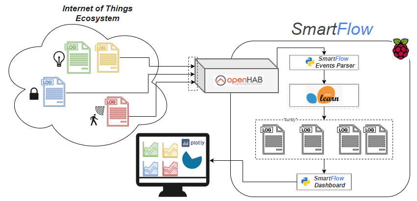

# ___SMARTFLOW___

NOTE: This README was written for a Linux Debian machine.
# FOR SYSTEM ADMINISTRATORS
## Installation: 
Explains how to download and install SmartFlow. It is assumed the System Administrator has all the prerequisites for the program and has the Anaconda virtual environment activated. Consult the user manual for all prerequisites. 
### Via Download: 
https://github.com/fjodoin/SmartFlow
1. Bring the cursor to the “Clone or download” drop down menu and select “Download Zip”
2. Extract the SmartFlow-master.zip to i.e. your Desktop             
3. Navigate to the SmartFlow-master/SmartFlow directory and install required Python3 libraries with the install command:
4. [PATH_to_dir]>pip3 install -r requirements.txt 
### Via Github:
1. Navigate to i.e. your Desktop, create a new folder which will contain the SmartFlow software.
2. Initialize the new folder as a git repository using the “git init” command:
>[PATH_to_dir]>git init
3. Clone the SmartFlow repository using the “git clone” command:
>[PATH_to_dir]>git clone https://github.com/fjodoin/SmartFlow.git
4. Pull from the SmartFlow repository master using the “git pull” command:
>[PATH_to_dir]>git pull
5. install required Python3 libraries with the install command:
>[PATH_to_dir]>pip3 install -r requirements.txt

## Configuration: 
After installing SmartFlow, it is necessary to configure paths used according to the user’s machine. For this explanation, it is assumed the System Admin installed SmartFlow on their Desktop. It is assumed the System Administrator has all the prerequisites from the User Manual.

### events_monitoring.sh, line 3
tail -n0 -f /var/log/openhab2/events.log | python3 /home/[username]/Desktop/SmartFlow/events_parser.py

### smartflow_dashboard.sh, line 3
tail -n0 -f /home/[username]/Desktop/SmartFlow/smartflow_events.log | python3 /home/[username]/Desktop/SmartFlow/dashboard.py

### System Administrative: 
It is recommended to use the Linux Raspbian operating system as SmartFlow was designed for being used on a microcontroller.

If any issues are discovered, please communicate the bug and the context in which it appeared on the Github page https://github.com/fjodoin/SmartFlow/issues

### Upgrading: 
It is recommended to keep the hosting machine update to date. This includes all the software as well. As the project is available on Github, two simple commands will verify for updates and install them if necessary. Navigate to the SmartFlow directory on the host machine and do the following commands:
>[PATH_to_dir]>git pull

>[PATH_to_dir]>pip3 install -r requirements.txt

If the first command doesn’t pull new updates, step 2 can be skipped

# FOR DEVELOPERS
## Architecture: 
The pipeline is separated into two sections; the ingress node being the Parser and the egress node being the Dashboard

### SmartFlow Events Parser (events_parser.py)
Module responsible for parsing incoming data shipped from the events_monitoring.sh Bash script. The events_parser.py module is launched inside the Bash script. 
- Lines 1 to 148 consists of Python imports and for variable, function and class declaration. The class OpenhabAgent is used for HTTP requests to the OpenHab2 smart home hub. It is used for obtaining initial temperatures and for synchronizing lights when the tenant changes rooms.
- Lines 149 to 174 assign unique IDs of known devices within the ecosystem to variables and the temperature of each room is obtained. An analysis is done on the smart home and the results are sent to the Dashboard (by logging results to smartflow_events.log).
- Lines 175 to 285 are the Main Loop: interrupt driven by line 179: data = sys.stdin.readline(). The system will wait at this line for a new log from events_monitoring.sh to be piped. Regular expression parsing is applied on the new log to get the unique ID, status, date and time. An analysis is done on the smart home and the results are sent to the Dashboard (by logging results to smartflow_events.log).

### SmartFlow Dashboard (dashboard.py)
Module responsible for displaying the ecosystem status from new logs added to smartflow_events.log. The dashboard.py module is launched inside the smartflow_dashboard.sh Bash script.
- Lines 1 to 16 are for Python imports.
- Lines 17 to 36 declare the ecosystem status dictionary which will be used as a global variable to keep the current status available throughout the module.
- Line 37 to 61 declare, instantiate and start the EventAgentThread class. This thread is responsible for obtaining piped data from the smartflow_dashboard.sh script; it will wait on line 46 (data = sys.stdin.readline()) until a new log from smartflow_events.log is obtained. The ecosystem status global dictionary is then updated.
- Line 62 to 126 consists of variable declarations used for the dashboard. Each device in the ecosystem has its own list of values, up to a certain length (i.e. 20 most recent values). These values are ordered in a FIFO list; when the 21st value is added to the list, the 1st value added  is removed, hence keeping the 20 most recent readings. All these individual lists are kept in a Python dictionary known as data.
- Lines 127 to 529 are used for the Web-Based User Interface Dashboard, leveraging the Plotly libraries. Line 529 launches the application, making it available on localhost:8050.

## Database Layout: 
SmartFlow keeps a log file from the ecosystem events. The file must be rotated and archived manually so that it does not grow too large. This file can be used to further train the Machine Learning Model integrated in the ecosystem, therefore it is the user’s job to decide how much / what data to keep. The log file is smartflow_events.log, where each entry is formatted as a json string.
>{"date": "2020-03-23",
>"time": "17:13:18.792", 
>"kitchen_light": 1, 
>"kitchen_motion_sensor": 0, 
>"kitchen_door_sensor": 0, 
>"kitchen_temperature": "19.0", 
>"office_light": 0, 
>"office_motion_sensor": 0, 
>"office_temperature": "19.74", 
>"living_room_light": 0, 
>"living_room_motion_sensor": 0, 
>"living_room_door_sensor": 0, 
>"living_room_temperature": "17.77",
>"bedroom_light": 0, 
>"bedroom_motion_sensor": 0, 
>"bedroom_temperature": "17.6", 
>"smartflow_status": 0}

Whenever the user would like to search for anomalies in their ecosystem, they can simply search the log file for "smartflow_status": 1 and analyze the entire ecosystem status at that timestamp.

## Developing Extensions:
As SmartFlow is open-source, the source code can be modified to accommodate for any ecosystem. There are sections which must be modified accordingly. The following steps will allow any developer to customize SmartFlow for their unique environment:
1. The Installation and Configuration steps from the System Administrators section above are assumed completed.
2. The developer must know how many rooms and devices are part of their ecosystem.
3. The Machine Learning Model must be trained accordingly
4. The Source Code is separated into two section: Events Parser and Dashboard:
  - events_parser.py: 
    1. Line 10 and 11 must point to the OpenHab2 installation. If the service is running on a different IP and/or Port, it is essential to adjust them here.
    2. Line 51 to 71 consists of the Ecosystem Status which is given to the Machine Learning Model to analyze. The smartflow_list on line 54 MUST be identical to the list used to train the model from step 3.
    3. Line 74 to 92 contains the Python dictionary which will be logged after analysis is complete by the model. This dictionary is initialized with all devices being off. It must contain all devices found in the ecosystem.
    4. Line 94 to 147 are used to synchronize the lights in the smart home. The developer must adjust this function according to the smart light found in their ecosystem.
    5. Line 151 to 170 hardcodes the unique IDs of each device to a variable and also obtains the current temperature for each room. Unique IDs can be found in the OpenHab2 panel or from raw logs in the OpenHab2 events.log file. Every device must be found in this section, along with their unique IDs.
    6. Line 192 to 285 (Main Loop) must be adjusted according to the device found in the ecosystem. Any device added / removed from step e above must be added / removed from the Main Loop.
  - dashboard.py
    1. Line 18 to 34 should be adjusted accordingly to the ecosystem devices, similar to step c from the events_parser.py above.
    2. Lines 67 to 122 must also be adjusted according to the ecosystem devices.
    3. Line 127 to 529 are for the Web-based Dashboard UI. The developer must know how many rooms are in their smart home. Each room will have its own subsection. The description that ensues is identical for all rooms in the ecosystem. The description uses the Kitchen as an example:
      1. Add the room into the HTML divider, similar to line 132. The room will require its own unique ID.
      2. Refer to lines 146 to 229: A call back function must be created for each room in order to render new data in near real-time on the dashboard.
      3. Lines 156 to 161 append the latest value of the devices found in the room.
      4. Lines 163 to 175 creates a container for the graphs required for the room.
      5. Lines 177 to 229 populate the graphs with the most recent values (depending on their length).

## Web Access:	
- SmartFlow Dashboard is accessible, by default, at localhost:8050
- OpenHab2 is accessible, by default, at localhost:8080
- SmartFlow is focused on being secure, therefore all services are run locally, never putting Ecosystem Logs or communication on the internet.
